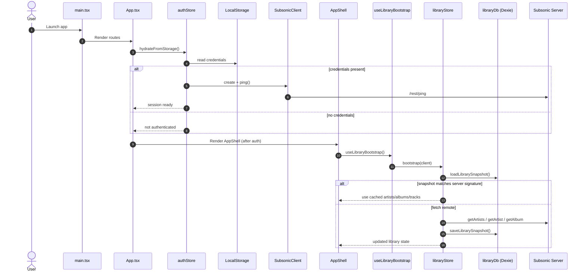
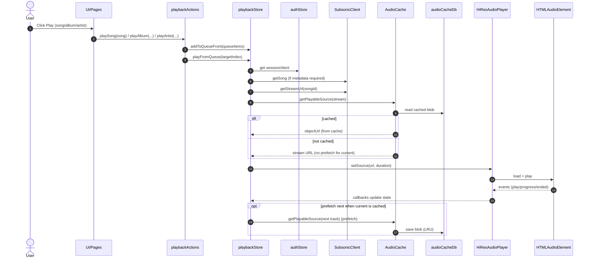
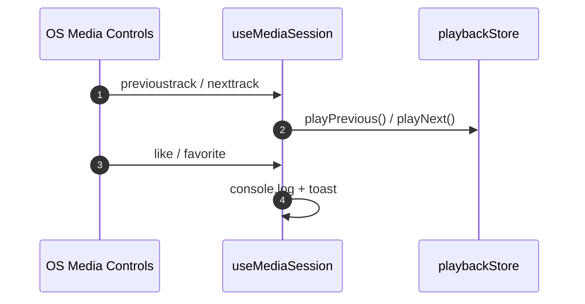

# 4Sonic Architecture & Sequence Diagrams (Mermaid)

This document captures the current app architecture and key runtime flows. The diagrams reflect the actual modules and data flow in the codebase.

## High‑Level Architecture (UI, Stores, Services, Storage)

```mermaid
flowchart LR
  %% Entry + App Shell
  subgraph Runtime[App Runtime]
    Main[main.tsx\nReactDOM + ThemeProvider + HashRouter]
    App[App.tsx\nRoutes + RequireAuth]
    Shell[AppShell\nTopBar/Left/Right/Bottom + Sonner]
    Pages[Pages\nLibrary/Albums/Artists/AlbumDetail/...]
    Components[UI Components\nMediaCard/AlbumSongsTable/etc]
  end

  %% Hooks
  subgraph Hooks
    LibraryBootstrap[useLibraryBootstrap]
    MediaSessionHook[useMediaSession]
    VisualizerHook[useAudioVisualizerData]
  end

  %% Stores (Zustand)
  subgraph Stores[State Stores (Zustand)]
    AuthStore[authStore\nSubsonic session + login/logout]
    LibraryStore[libraryStore\nartists/albums/tracks + bootstrap]
    PlaybackStore[playbackStore\nplayer state + queue]
    UiPrefsStore[uiPreferencesStore\nvisualizer + toast prefs]
    RightSidebarStore[rightSidebarStore\nqueue panel]
  end

  %% Services
  subgraph Services
    SubsonicClient[SubsonicClient\nREST API + stream URL]
    AudioPlayer[HiResAudioPlayer\nHTMLAudio + WebAudio]
    AudioCache[AudioCache\nIndexedDB + fetch]
  end

  %% Storage
  subgraph Storage
    LocalStorage[LocalStorage\nAuth credentials + prefs]
    LibraryDB[Dexie: libraryDb\nartists/albums/tracks snapshot]
    AudioCacheDB[Dexie: audioCacheDb\ntrack blobs]
  end

  %% External
  subgraph External
    SubsonicServer[Subsonic/Navidrome Server]
    MediaSession[OS Media Session API]
    BrowserAudio[HTMLAudioElement/WebAudio]
  end

  %% Wiring
  Main --> App --> Shell --> Pages --> Components
  Shell --> LibraryBootstrap --> LibraryStore
  Shell --> MediaSessionHook --> PlaybackStore
  Shell --> VisualizerHook --> PlaybackStore

  Pages --> AuthStore
  Pages --> LibraryStore
  Pages --> PlaybackStore
  Components --> PlaybackStore
  Components --> RightSidebarStore
  Components --> UiPrefsStore

  AuthStore --> SubsonicClient
  LibraryStore --> SubsonicClient
  PlaybackStore --> SubsonicClient

  PlaybackStore --> AudioPlayer
  PlaybackStore --> AudioCache

  AudioCache --> AudioCacheDB
  LibraryStore --> LibraryDB
  AuthStore --> LocalStorage
  UiPrefsStore --> LocalStorage
  PlaybackStore --> LocalStorage

  SubsonicClient --> SubsonicServer
  AudioPlayer --> BrowserAudio
  MediaSessionHook --> MediaSession
```

## Startup & Library Bootstrap Sequence



## Playback (Play Now / Queue + Audio Cache) Sequence



## Media Session Controls (Prev/Next + Like)



## Queue Data Model (Normalized + Order)

```mermaid
flowchart TB
  Queue[queue: QueueItem[]] --> Order[queueOrder: number[]]
  Order --> Position[queuePosition]

  note right of Queue
    queue is the source list
    (original insertion order)
  end note

  note right of Order
    queueOrder indexes into queue
    and changes when shuffle/reorder
  end note

  note right of Position
    queuePosition = current index
    within queueOrder
  end note
```

## Storage & Persistence Notes
- Auth credentials and UI preferences are stored in LocalStorage.
- Library snapshot is persisted in IndexedDB via Dexie (`libraryDb`).
- Audio cache persists track blobs in IndexedDB via Dexie (`audioCacheDb`).
- Playback preferences (volume/mute/shuffle/repeat) are persisted via Zustand `persist`.
